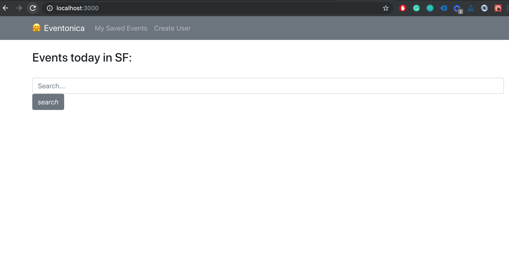
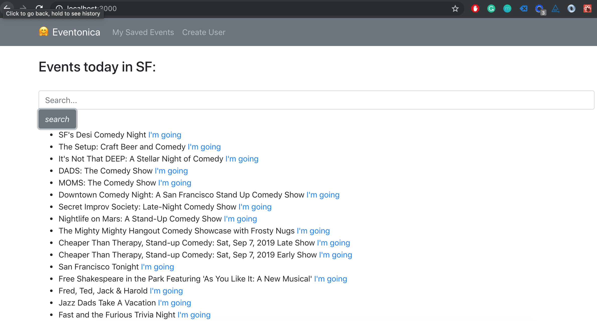
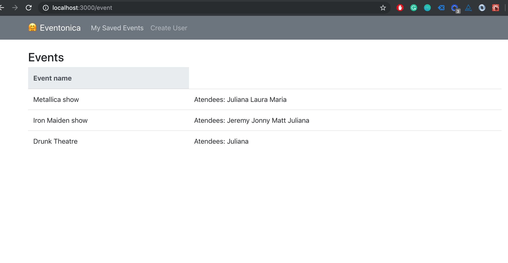
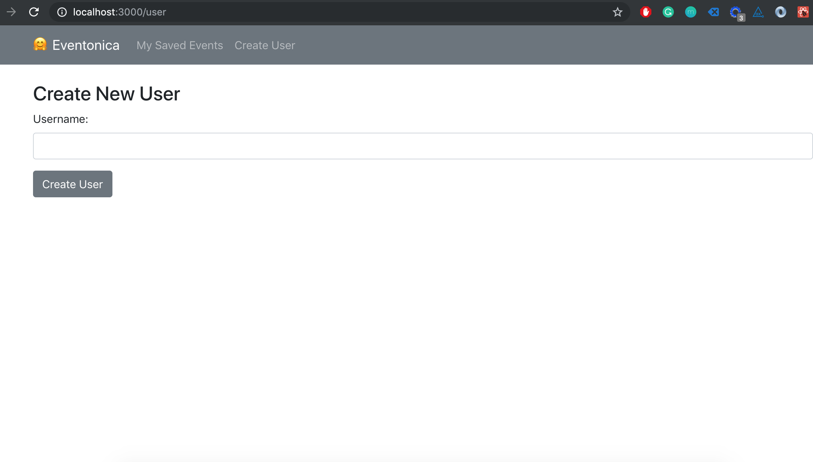
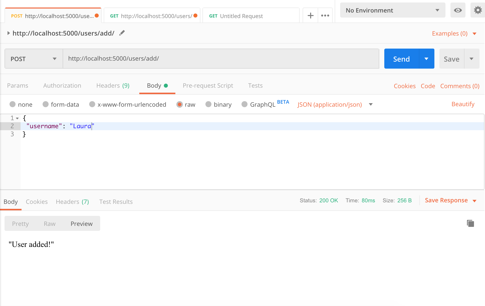
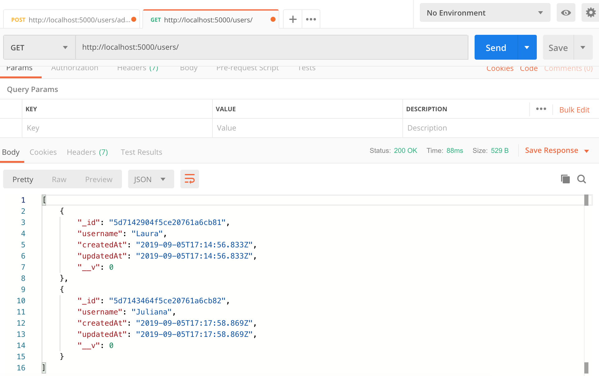
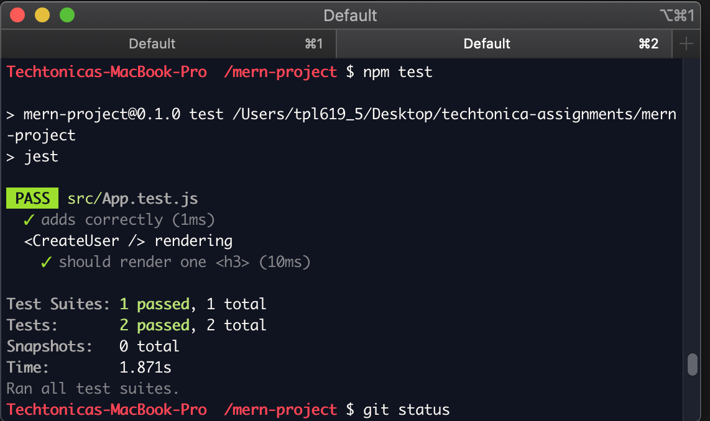

# 🤗 Eventonica

Find out about events in SF today!

### MERN stack project using:
- MongoDB
- Express
- React
- Node.js
- Eventbrite API
- Mongoose
- Bootstrap
- Axios
- Jest
- Enzyme

### Deployed at:
[eventonica-r.herokuapp.com](https://eventonica-r.herokuapp.com/)

### How to set up:
Run server: 
```
$ cd backend
$ npm start
```
Run React: 
```
$ npm start
```






Postman




Enzyme / Jest


To run tests: npm test

